# B2B Sales Agentic AI System

A production-ready multi-agent AI system for B2B sales automation, featuring intelligent agent orchestration, real-time chat, and automated sales workflows.

## 🚀 Features

- **Multi-Agent Architecture**: 15+ specialized agents working together via Agent-to-Agent (A2A) protocol
- **Intelligent Orchestration**: Super Agent coordinates all sub-agents for seamless workflows
- **Auto-Triggered Workflows**: Automatic prospect creation and lead generation based on conversation context
- **Real-Time Chat**: WebSocket-based chat interface with markdown support
- **RAG Integration**: Retrieval-Augmented Generation for policy and product information
- **Agent Activity Tracking**: Visual tags showing which agents, tools, and protocols were used
- **Telemetry Dashboard**: Real-time monitoring of system health and agent activity

## 🏗️ Architecture

### System Overview

```mermaid
graph TB
    User[👤 User Interface<br/>WebSocket]
    
    SuperAgent[🧠 Super Agent<br/>Gemini 2.0 Flash<br/>Orchestrator]
    
    %% Policy Agents
    ProductPolicy[📋 Product Policy Agent<br/>MCP]
    OrderPolicy[📋 Order Policy Agent<br/>MCP]
    ServicePolicy[📋 Service Policy Agent<br/>MCP]
    FulfillmentPolicy[📋 Fulfillment Policy Agent<br/>MCP]
    
    %% Operational Agents
    ProspectAgent[🎯 Prospect Agent<br/>A2A - Auto-triggered]
    LeadGenAgent[🎯 Lead Generation Agent<br/>A2A - Auto-triggered]
    OrderAgent[🎯 Order Agent<br/>A2A]
    
    %% Service Agents
    ServiceabilityAgent[🌐 Serviceability Agent<br/>REST API]
    OfferAgent[🌐 Offer Agent<br/>REST API]
    PostOrderAgent[🌐 Post Order Comm Agent<br/>REST API]
    
    %% Workflow Agents
    AddressAgent[⚙️ Address Validation<br/>LangGraph]
    FulfillmentAgent[⚙️ Fulfillment Agent<br/>LangGraph]
    ActivationAgent[⚙️ Service Activation<br/>LangGraph]
    PostActivationAgent[⚙️ Post Activation<br/>LangGraph]
    
    %% Supporting Systems
    RAG[(📚 RAG System<br/>ChromaDB)]
    DB[(💾 SQLite<br/>Database)]
    Gemini[☁️ Gemini API<br/>2.0 Flash]
    
    %% User to Super Agent
    User -->|WebSocket| SuperAgent
    
    %% Super Agent to Policy Agents
    SuperAgent -->|MCP| ProductPolicy
    SuperAgent -->|MCP| OrderPolicy
    SuperAgent -->|MCP| ServicePolicy
    SuperAgent -->|MCP| FulfillmentPolicy
    
    %% Super Agent to Operational Agents
    SuperAgent -->|A2A| ProspectAgent
    SuperAgent -->|A2A| LeadGenAgent
    SuperAgent -->|A2A| OrderAgent
    
    %% Super Agent to Service Agents
    SuperAgent -->|REST| ServiceabilityAgent
    SuperAgent -->|REST| OfferAgent
    SuperAgent -->|REST| PostOrderAgent
    
    %% Super Agent to Workflow Agents
    SuperAgent -->|LangGraph| AddressAgent
    SuperAgent -->|LangGraph| FulfillmentAgent
    SuperAgent -->|LangGraph| ActivationAgent
    SuperAgent -->|LangGraph| PostActivationAgent
    
    %% Sub-Agent to Sub-Agent Communication
    OrderAgent -.->|A2A| ServiceabilityAgent
    ServiceabilityAgent -.->|A2A| FulfillmentAgent
    
    %% Supporting Systems
    SuperAgent -->|Query| RAG
    SuperAgent -->|Store/Retrieve| DB
    SuperAgent -->|LLM Calls| Gemini
    
    %% Styling
    classDef policy fill:#3b82f6,stroke:#1e40af,color:#fff
    classDef operational fill:#10b981,stroke:#059669,color:#fff
    classDef service fill:#f59e0b,stroke:#d97706,color:#fff
    classDef workflow fill:#8b5cf6,stroke:#6d28d9,color:#fff
    classDef super fill:#ef4444,stroke:#dc2626,color:#fff
    classDef support fill:#6b7280,stroke:#4b5563,color:#fff
    
    class SuperAgent super
    class ProductPolicy,OrderPolicy,ServicePolicy,FulfillmentPolicy policy
    class ProspectAgent,LeadGenAgent,OrderAgent operational
    class ServiceabilityAgent,OfferAgent,PostOrderAgent service
    class AddressAgent,FulfillmentAgent,ActivationAgent,PostActivationAgent workflow
    class RAG,DB,Gemini support
```



### Agent Types

**Policy Agents** (MCP-based)
- Product Policy Agent
- Order Policy Agent
- Service Policy Agent
- Fulfillment Policy Agent

**Operational Agents** (ADK-based)
- Prospect Agent (auto-triggered)
- Lead Generation Agent (auto-triggered)
- Order Agent (with sub-agent communication)

**Service Agents** (Strands-based)
- Serviceability Agent
- Offer Agent
- Post Order Communication Agent

**Workflow Agents** (LangGraph-based)
- Address Validation Agent
- Fulfillment Agent
- Service Activation Agent
- Post Activation Agent

### Communication Flow

```
User → Super Agent → Sub-Agents (via A2A Protocol)
                   ↓
              Order Agent → Serviceability Agent → Fulfillment Agent
```

## 📋 Prerequisites

- Python 3.13+
- Google Gemini API key
- SQLite (included)

## 🔧 Installation

1. **Clone the repository**
```bash
git clone https://github.com/sudhamanc/SalesAgenticAIDemo.git
cd SalesAgenticAIDemo
```

2. **Create virtual environment**
```bash
python3 -m venv venv
source venv/bin/activate  # On Windows: venv\Scripts\activate
```

3. **Install dependencies**
```bash
pip install -r requirements.txt
```

4. **Configure environment**
```bash
cp .env.example .env
# Edit .env and add your GOOGLE_API_KEY
```

## 🚀 Quick Start

1. **Start the application**
```bash
python main.py
```

2. **Access the UI**
```
http://localhost:8000
```

3. **Try a sample conversation**
```
"Hi, I'm John from TechCorp LLC at 123 Main St. 
We have 100 employees and need business internet."
```

The system will automatically:
- Create a prospect record
- Generate a qualified lead
- Provide service recommendations
- Invoke relevant agents as needed

## 🎯 Key Capabilities

### Auto-Triggered Workflows

**Prospect Creation** - Automatically triggered when:
- Company name is mentioned
- Contact information provided

**Lead Generation** - Automatically triggered when:
- Prospect exists
- Service interest expressed
- Employee count provided

**Order Processing** - Sub-agent communication flow:
1. Order Agent validates request
2. Calls Serviceability Agent to check address
3. Calls Fulfillment Agent to schedule installation
4. Returns complete order details

### Agent Activity Tracking

Every response shows:
- 🤖 **Blue tags**: Sub-agents invoked
- ⚡ **Green tags**: Tools used (Gemini, RAG, etc.)
- 📡 **Orange tags**: Communication protocols (A2A, MCP, REST)

## 📊 Telemetry Dashboard

Access real-time system metrics at:
```
http://localhost:8000/telemetry
```

Features:
- Active conversations
- Agent invocation counts
- Database statistics
- Conversation history viewer

## 🛠️ Technology Stack

- **Backend**: FastAPI, Python 3.13
- **LLM**: Google Gemini 2.0 Flash
- **Database**: SQLite
- **Vector Store**: ChromaDB
- **Frontend**: Vanilla JavaScript, HTML5, CSS3
- **Protocols**: WebSocket, A2A, MCP, REST

## 📁 Project Structure

```
├── agents/              # All agent implementations
│   ├── super_agent.py   # Main orchestrator
│   ├── policy_agents/   # MCP-based policy agents
│   ├── adk_agents/      # ADK operational agents
│   ├── strands_agents/  # Strands service agents
│   └── langgraph_agents/# LangGraph workflow agents
├── database/            # SQLite database layer
├── rag/                 # RAG implementation
│   └── documents/       # Policy documents
├── shared/              # Shared utilities
│   └── protocols.py     # A2A protocol implementation
├── web/                 # Frontend UI
│   ├── index.html
│   └── static/
├── telemetry/           # Telemetry dashboard
├── config/              # Configuration
├── main.py              # Application entry point
└── requirements.txt     # Python dependencies
```

## 🔐 Security

- API keys stored in `.env` (gitignored)
- No sensitive data in repository
- SQLite database for local development

## 📝 License

MIT License - See LICENSE file for details

## 👥 Contributing

Contributions welcome! Please open an issue or submit a pull request.

## 📧 Contact

For questions or support, please open an issue on GitHub.

---

**Built with ❤️ using Google Gemini and FastAPI**
